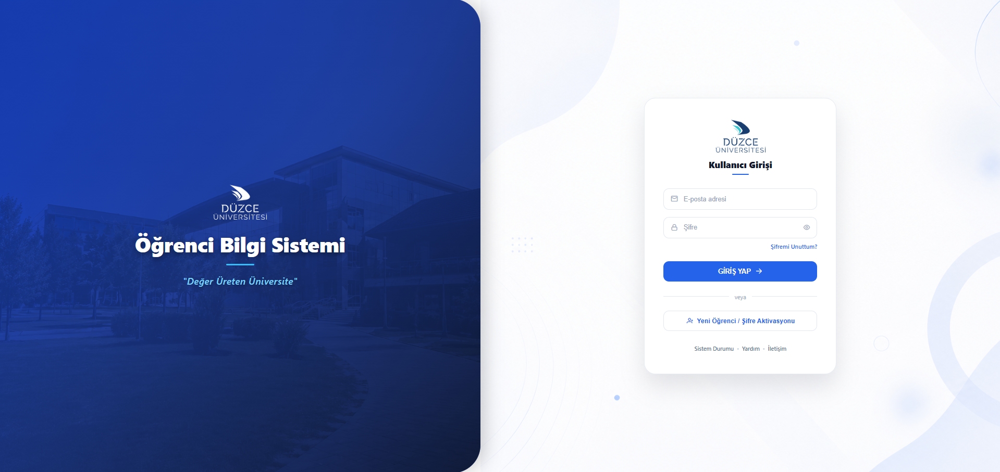
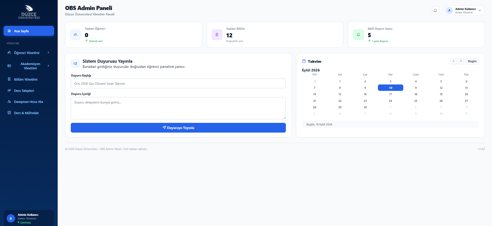

# Öğrenci Bilgi Sistemi

ASP.NET Core 8, Entity Framework Core, SQL Server ve Angular 17 ile geliştirilmiş bir eğitim projesidir. Üniversitenin resmî uygulaması değildir.

## Özellikler

- Yönetici, akademisyen ve öğrenci rolleri
- Öğrenci, akademisyen, bölüm ve ders yönetimi
- Ders talepleri ve danışman onayı
- Not, devamsızlık ve transkript özeti
- Duyurular, bildirimler ve hesap aktivasyonu
- Düzce Üniversitesi EBS üzerinden müfredat aktarımı

## Ekran görüntüleri

### Kullanıcı girişi

### Yönetici paneli

Görüntüler yerel geliştirme ortamına aittir ve gerçek bir üniversite OBS hizmetini temsil etmez.

## Proje yapısı

- `ObsOgrenciBilgiSistemi/`: ASP.NET Core API ve veritabanı migration dosyaları
- `Obs_Frontend/obs_frontend.client/`: Angular arayüzü
- `Obs_Frontend/Obs_Frontend.Server/`: Visual Studio ön yüz sunucu projesi

## Yerel kurulum

Gereksinimler: .NET 8 SDK, Angular 17 ile uyumlu Node.js/npm ve SQL Server (Windows üzerinde LocalDB kullanılabilir).

1. `ObsOgrenciBilgiSistemi/appsettings.Local.example.json` dosyasını aynı dizinde `appsettings.Local.json` olarak kopyalayın.
2. `Jwt:Key` alanına rastgele üretilmiş, en az 32 bayt uzunluğunda özel bir anahtar girin. `BootstrapAdmin` alanına kendi yönetici e-postanızı ve güçlü bir şifre yazın. Hazır/ortak yönetici şifresi yoktur. Bu dosya Git kapsamı dışındadır.
3. Gerekirse `ConnectionStrings:DefaultConnection` değerini yerel dosyada değiştirin. Varsayılan bağlantı LocalDB üzerindeki `ObsOgrenciBilgiSistemiDb` veritabanıdır.
4. API dizininde `dotnet restore` ve ardından `dotnet ef database update` çalıştırın (EF Core 8 CLI aracı gerekir).
5. `dotnet run --launch-profile https` ile API'yi başlatın. İlk açılışta roller ve yapılandırılmış yönetici oluşturulur. Mevcut yönetici şifresi açılışta sıfırlanmaz. İlk kurulumdan sonra `BootstrapAdmin:Password` alanını yerel dosyadan kaldırabilirsiniz.
6. Angular dizininde `npm ci` ve `npm start` çalıştırın. Gerekirse `dotnet dev-certs https --trust` ile yerel geliştirme sertifikasına güvenin.

API adresi `Obs_Frontend/obs_frontend.client/src/environments/environment.ts` dosyasında `https://localhost:7066/api` olarak tanımlıdır. Başka bir adresle çalıştırırken bu değeri ve `Cors:AllowedOrigins` listesini güncelleyin. Aktivasyon bağlantıları için `Frontend:BaseUrl` değerini kullanılan arayüz adresiyle eşleştirin. E-posta işlemleri için `SmtpSettings` değerlerini yerel dosyada veya ortam değişkenlerinde yapılandırın.

Sunucuda `Jwt__Key`, `ConnectionStrings__DefaultConnection` ve `SmtpSettings__Password` gibi ortam değişkenleri kullanılabilir. Ortam değişkenleri yerel dosyadan önceliklidir. Migration işlemleri uygulama başlangıcında otomatik çalıştırılmaz.

## Doğrulama

- API: `dotnet build ObsOgrenciBilgiSistemi/ObsOgrenciBilgiSistemi.csproj`
- Arayüz: Angular dizininde `npm run build`
- Arayüz testleri: Angular dizininde `npm test -- --watch=false --browsers=ChromeHeadless`

## Paylaşım

Veritabanı kayıtları kaynak kodla birlikte paylaşılmaz. Gerçek kişilere ait verileri örnek veri olarak eklemeyin. `.gitignore`; yerel ayarları, anahtarları, veritabanı dosyalarını, derleme çıktılarını, kişisel raporları, sunumları ve çalışma ekran görüntülerini dışarıda tutar. GitHub'a klasörü topluca sürüklemek yerine Git'in izlediği dosyaları gönderin. Önceki prototip klasörleri yerelde korunur, paylaşım kapsamına alınmaz.

Müfredat aktarımı dış EBS hizmetinin erişilebilirliğine ve sayfa yapısına bağlıdır. Logo ve görsellerin kullanım hakkını kendi yayın kapsamınız için değerlendirin.
